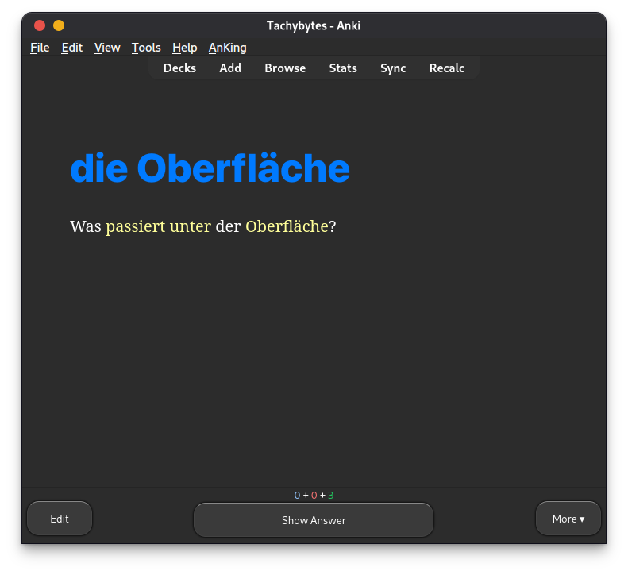
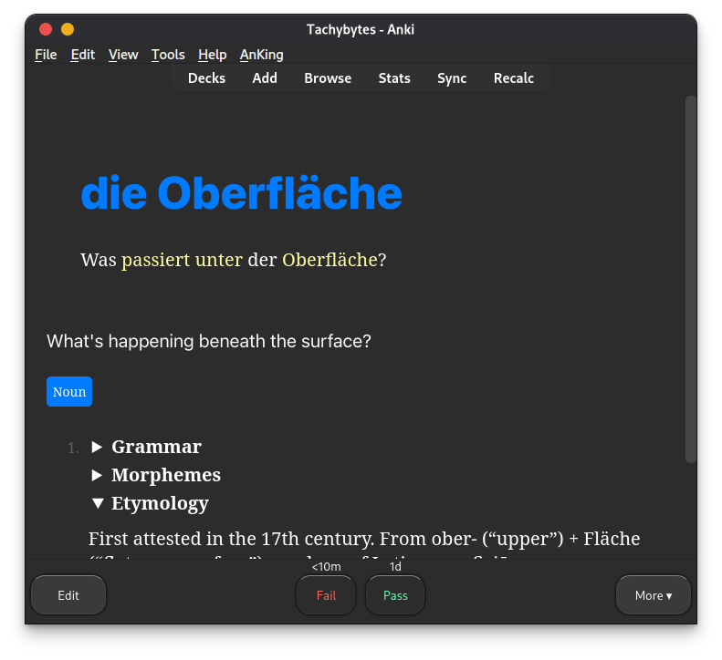

# Anki + Yomitan Template
Anki flashcard template integrated with Yomitan for language learning.

## Screenshots

## Anki Add-ons
- AnkiConnect (2055492159)
- AnkiMorphs (472573498)
- Edit Field During Review (1020366288)
- Google Translate (1536291224)
- PassFail 2 Remove the Easy and Hard Buttons (876946123)
- Symbols As You Type (2040501954)
- The KING of Button Add-ons (374005964)

## How to use
1. Download the `anki-yomitan-template.apkg` file and import it into Anki.
2. Make sure to set up AnkiMorphs and Yomitan.

## Changelog
### 1.0.0 — 2026-03-10
- Initial release

## License
MIT
